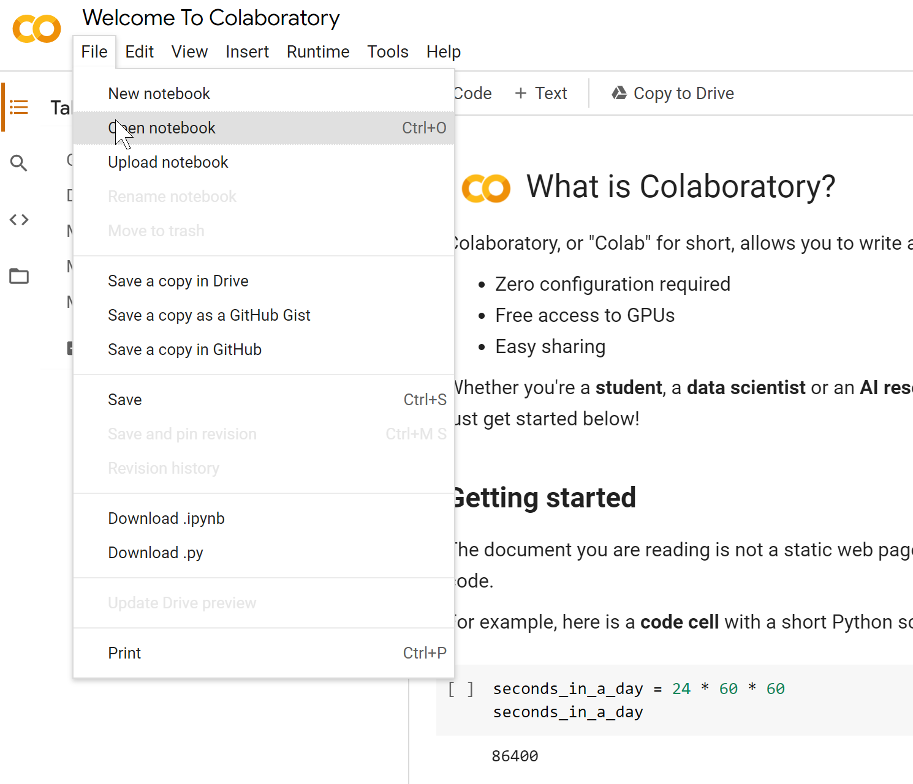
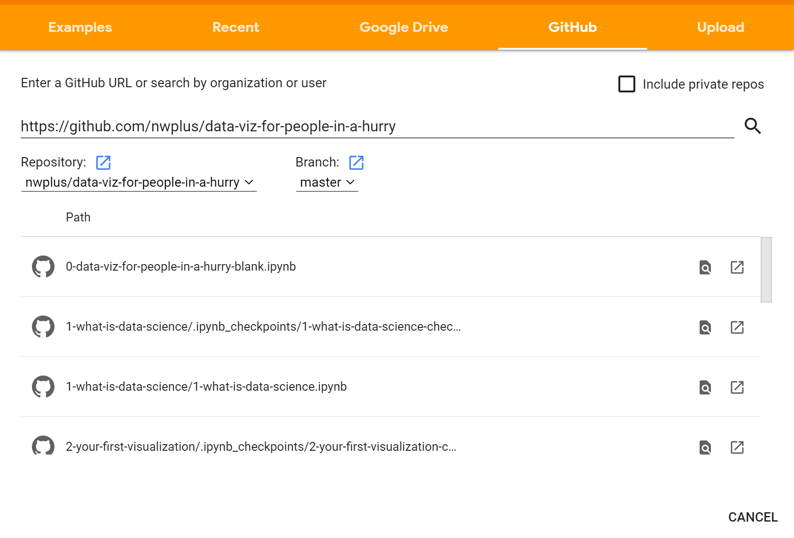
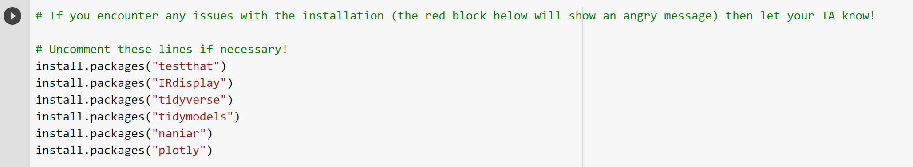

# Data Visualization (with R) for People in a Hurry

This workshop serves as a quick and dirty introduction to data science fundamentals, with a focus on visualization. It is currently a part of nwPlus' Workshop Series happening this fall. The title is loosely inspired by Neil deGrasse Tyson's "Astrophysics for People in a Hurry."

     

> “Data Scientist (n.): Person who is better at statistics than any software engineer and better at software engineering than any statistician.”  
> ―Josh Wills, Director of Data Engineering at Slack

## Participate

Want to participate in this workshop? Join us on November 12th at 6pm. This workshop will be hosted on Zoom. RSVP [here](https://lu.ma/nwplus-dataviz)!

Psst... interested in using this workshop? Don't be afraid to [reach out](mailto:michaelfromyeg@gmail.com?subject=Data%20Visualization%20for%20People%20in%20a%20Hurry)!

### Pre-requisites

None! To take part in this workshop, just show up ready to learn. All coding will take place on UBC's Syzygy servers. Access the server [here](https://ubc.syzygy.ca/). If you don't have access to UBC's servers, that's no problem! You can also access the starter file with Google Colab, available [here](https://colab.research.google.com/b). The key point is that **no environment setup is required to participate**.

## Setup

### Getting setup with Syzygy

1. First download the starter file, available [here](0-data-viz-for-people-in-a-hurry-blank.ipynb).
2. Then, head to either UBC's Syzygy servers.
3. Hit `File` > `Upload` from the top context menu.
4. Upload the starter file.
5. Open the file!

Once you begin, you'll need to uncomment all of the lines in the first cell and run the first cell to install the necessary dependencies. This will be covered in the workshop.

### Getting setup with Google Colab

1. Open [Google Colab](https://colab.research.google.com/).
2. Hit `File` > `Open` from the top context menu, or `CTRL + O` (or `CMD + O` if you're on a Mac).
3. Choose the GitHub option, and enter the following link: `https://github.com/nwplus/data-viz-for-people-in-a-hurry`
4. Select the file called `0-data-viz-for-people-in-a-hurry.ipynb` (it should be first in the list of files that appear).
5. And you're down!

Once you begin, you'll need to uncomment all of the lines in the first cell and run the first cell to install the necessary dependencies. This will be covered in the workshop.

Here are some helpful screenshots of the steps I just described.

     

     

     

## About

In this workshop you will...

- Explore the data science process from start to finish
- Learn how to create effective visualizations
- Use your new skills to predict whether a breast tumor is benign and malignant (in part 2!)

### Data set

We will be using UCI's Breast Cancer data set, available [here](https://www.kaggle.com/uciml/breast-cancer-wisconsin-data).

### Slides

The slide deck for this workshop is available [here](https://docs.google.com/presentation/d/e/2PACX-1vQ-eSp1jPYcSb9kEwbeTrmLcceXPi1D1jtbDmIggzhWHPh4taLGSw-_3yb8N9UN5D9z55M0q3H1-V6c/pub?start=false&loop=false&delayms=30000).

## Feedback

Have feedback for the workshop? Fill out [this](https://forms.gle/z6VMtV3idWampXD39) form!

## Contributing

Spot an issue or have something to add? PRs are absolutely welcome—feel free to make an issue first so we can discuss the proposed changes.
